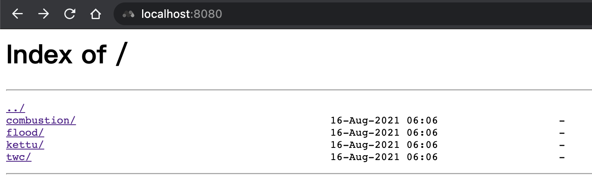

## transmission-webui

This project contains 4 transmission web clients:
- [combustion](https://github.com/Secretmapper/combustion)
- [transmission-web-control](https://github.com/ronggang/transmission-web-control)
- [kettu](https://github.com/endor/kettu)
- [flood-for-transmission](https://github.com/johman10/flood-for-transmission)

## Usage
Run `docker run -e TRANSMISSION_URL=http://your.transmission.url -p 8080:80 quay.io/erona/transmission-webui`

